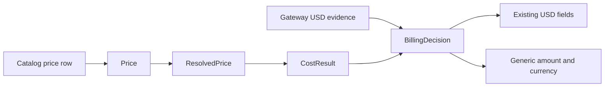

# Label native-currency costs

| | |
|---|---|
| **Author** | Vasiliy |
| **Created** | 2026-10-02 |
| **URL** | https://github.com/PioneerSquareLabs/metergraph/issues/65 |
| **Status** | Draft |
| **Reviewers** | Open source maintainers: pending |

## Objective

Represent a catalog price in its native currency without changing existing USD behavior or silently labeling a non-USD amount as dollars.

## Background

The pricing catalog declares `currency: USD`, and the loader rejects any other document-level currency. Downstream types also expose dollar-specific names such as `cost_usd`, `reported_cost_usd`, and `catalog_cost_usd`.

This is safe for the current catalog, but it gives a regional or self-hosted model with a native-currency price no truthful representation. Putting that amount into `cost_usd` would mislabel it. Converting it before catalog ingestion would hide the exchange rate and its effective time.

Issue [#65](https://github.com/PioneerSquareLabs/metergraph/issues/65) proposed carrying an ISO 4217 currency through the pricing core while preserving all existing USD behavior. This design adopts that direction and adds an explicit generic amount so a currency label never changes the meaning of a field named `cost_usd`.

## Goals

- Let a catalog row preserve the currency in which a provider publishes a price.
- Keep current USD catalog results and public `*_usd` fields unchanged.
- Prevent a non-USD amount from appearing in a field named `cost_usd`.
- Carry native amount and currency through price resolution and billing selection.
- Make later persistence and aggregation work possible without adding exchange-rate behavior now.

## Non-goals

- Currency conversion or exchange-rate storage.
- Adding non-USD rows to the bundled public catalog.
- Aggregating, sorting, or comparing amounts across currencies.
- Changing database columns, server API responses, dashboards, or reports.
- Changing gateway-reported cost fields, which remain explicitly USD.
- Supporting currency-specific rounding rules.

## Scenarios

### Existing USD price

1. A catalog row omits `currency`.
2. The row inherits the document currency, currently `USD`.
3. Pricing returns the same `cost_usd`, status, and price identifier as before.
4. The generic amount equals `cost_usd` and is labeled `USD`.

### Native EUR price

1. A catalog row declares `currency: EUR` and EUR-denominated token rates.
2. Resolution returns a `Price` and `ResolvedPrice` labeled `EUR`.
3. Pricing returns the computed generic amount labeled `EUR`.
4. `cost_usd` is `None`; the EUR amount is never presented as dollars.
5. Billing preserves the native catalog amount and currency when no qualified gateway-reported USD cost is selected.

### Gateway-reported USD cost with a native-currency catalog row

1. A qualified gateway reports a USD amount using the existing evidence fields.
2. Billing selects that reported amount under the current precedence rule.
3. The effective generic amount is labeled `USD`.
4. The independent native catalog amount and its currency remain available for inspection, but are not compared with the USD amount.

## Design

### Catalog and loader

The document-level `currency` remains required and defaults no rows implicitly outside that document. The bundled catalog remains `USD`.

Each price row may declare `currency`. When omitted, it inherits the document-level currency. The loader normalizes the value to uppercase and accepts exactly three ASCII letters. Catalog authors are responsible for using an assigned ISO 4217 code; the core will not add a dependency or maintain its own currency registry.

`Price` gains `currency: str`, defaulting to `USD` for direct construction compatibility.

### Resolution and pricing

`ResolvedPrice` exposes `currency`, derived from its selected `Price` so the value cannot diverge.

`CostResult` gains:

- `cost`: the computed amount in `currency`;
- `currency`: the native currency when `cost` is present.

The existing `cost_usd` field remains unchanged for USD results. For a non-USD result, `cost` contains the amount and `cost_usd` is `None`.

Existing direct construction of a USD `CostResult` remains valid. Compatibility initialization mirrors a supplied legacy `cost_usd` into `cost` and labels it `USD` when the new fields are omitted.

### Billing selection

`BillingDecision` gains:

- `cost` and `cost_currency` for the selected amount;
- `catalog_cost` and `catalog_cost_currency` for independent catalog evidence.

Existing `cost_usd`, `reported_cost_usd`, `reported_upstream_cost_usd`, and `catalog_cost_usd` fields retain their current meanings.

The current precedence rule remains:

1. A qualified gateway-reported USD amount wins.
2. Otherwise, use the catalog amount in its native currency.
3. Otherwise, return no amount.

Billing does not compute a discrepancy between amounts in different currencies.

### Server boundary

The server currently persists only `cost_usd`. A non-USD decision therefore stores no dollar amount. Native-currency persistence requires a separate design and database migration before a bundled non-USD catalog row can be used end to end.

This boundary is deliberate. It prevents silent corruption while allowing the reusable core to represent native prices first.

## Compatibility

- Existing catalog files remain valid.
- Existing USD results keep the same `cost_usd` values and statuses.
- Existing gateway evidence remains USD-only.
- New dataclass fields use defaults so existing keyword and positional construction remains valid.
- The bundled catalog remains entirely USD, so server behavior does not change in this increment.

## Validation

Tests will prove:

- omitted row currency inherits `USD` and preserves existing results;
- a EUR row resolves with `currency == "EUR"`;
- a EUR calculation exposes `cost` but not `cost_usd`;
- billing preserves a native catalog amount and currency;
- qualified gateway USD evidence still wins without comparing unlike currencies;
- malformed currency values are rejected;
- package artifacts preserve the public compatibility behavior.

## Security and privacy

Currency codes and computed amounts add no new sensitive input. Tests use synthetic models and values. Errors must not include prompts, tenant identifiers, provider credentials, or private paths.

The main integrity risk is financial mislabeling. Keeping non-USD amounts out of `*_usd` fields is the controlling invariant.

## Alternatives considered

### Add only `currency` beside `cost_usd`

This is the smallest change, but a EUR amount could still inhabit a field whose name promises dollars. The label would contradict the API instead of fixing it.

### Convert every native price to USD during loading

This preserves downstream types but requires an exchange-rate source, effective timestamps, rounding rules, and reproducibility policy. It also loses the provider's published native amount. Conversion is outside this increment.

### Rename all dollar fields immediately

Replacing `cost_usd` with a generic money type would be cleaner in isolation but would break core and server consumers. Additive generic fields provide a migration path without changing current USD behavior.

### Store currency only on the catalog document

One document-level currency cannot represent rows from providers that publish in different currencies. Row inheritance keeps the common USD case concise while allowing an explicit exception.

## Open issues

### Native-currency persistence

- **Problem:** The server schema and APIs persist only dollar amounts.
- **Options:** Add amount and currency columns in a later migration, or keep non-USD support limited to core consumers.
- **Next step:** Design persistence only when a concrete end-to-end use case requires it.

### Cross-currency reporting

- **Problem:** Reports cannot total unlike currencies without conversion.
- **Options:** Group totals by currency, or add an effective-dated FX subsystem.
- **Next step:** Gather contributor and user requirements before selecting either approach.
